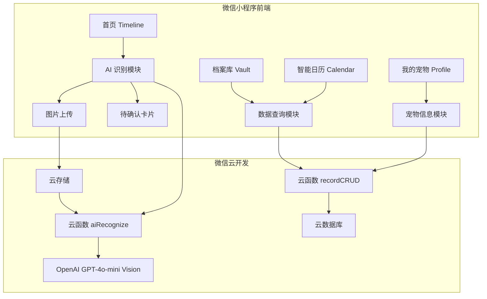

## 产品概述

"宠秘（Pet Secretary）"是一款以 AI 图片识别为核心能力的宠物生活管理微信小程序。用户只需拍照或上传聊天截图、病历照片、手写日历照片，AI 自动提取结构化数据（时间、事件类型、备注等），经用户确认后归档到对应分类，形成完整的宠物生活时间线。

## 核心功能

### 四个核心页面

1. **首页 (Timeline/Feed)** - 以时间轴形式展示已确认的宠物记录卡片（复查预约、驱虫记录等），顶部设置 AI 识别 FAB 悬浮按钮作为核心操作入口，卡片按时间倒序排列，不同事件类型使用不同色彩标识
2. **档案库 (Vault/Dashboard)** - 聚合展示页，顶部设置"医疗健康、饮食、开销、成长"四个金刚区分类入口，下方展示各分类记录摘要
3. **智能日历 (Calendar)** - 月历视图展示从图片中提取的日程和预约，支持月份切换，标记有事件的日期，点击日期展示当日事件列表
4. **我的宠物 (Profile)** - 宠物头像、基本信息（名字、品种、生日）设置，简洁设置项列表

### AI 图片识别交互流程

- 点击 FAB 按钮弹出底部面板，选择拍照或从相册上传
- 上传后展示"AI 正在识别"Loading 动画
- 识别完成后展示待确认卡片，呈现结构化数据（时间、事件类型、备注）
- 用户可一键确认或微调字段后保存

### UI 风格

- 严格参考 shadcn 设计风格：克制、优雅、专业、高端工具感
- 配色以 Neutral/Zinc 灰色系为基底，薄荷绿作为 accent 克制使用
- 卡片为白色背景 + 1px 细边框 + 极小圆角，无重阴影
- 字体干净无衬线，字重层次分明
- 宽松规律的间距，breathing room 充足

## 技术栈

- **前端框架**: Uni-app (Vue 3 Composition API) + TypeScript
- **样式方案**: 自定义 SCSS 设计系统，手写组件严格还原 shadcn 视觉风格（小程序环境无法使用 Tailwind CSS 和 shadcn-vue）
- **后端服务**: 微信云开发 (CloudBase) - 云函数、云数据库、云存储
- **AI 能力**: 云函数集成 OpenAI GPT-4o-mini Vision API 进行多模态图片识别
- **构建工具**: Vite (Uni-app 内置)

## 实现方案

### 整体策略

基于 Uni-app (Vue 3) 构建微信小程序，前端手写一套 shadcn 风格的组件系统（不依赖任何第三方 UI 库），通过 SCSS 变量系统实现 shadcn 的 CSS Variables 设计规范（--background、--foreground、--card、--primary、--muted 等）。核心 AI 识别逻辑放在云函数中，用户上传图片至云存储后触发 GPT-4o-mini Vision API 识别，返回结构化 JSON 供前端渲染待确认卡片。

### 关键技术决策

1. **shadcn 风格还原策略**: 在 SCSS 中定义与 shadcn 完全对齐的 CSS Variables 体系（--background、--foreground、--border、--ring、--primary 等），所有组件使用这些变量，确保视觉一致性。手写 Button、Card、Badge、Input、Dialog 等基础组件，还原 shadcn 的圆角(8px)、边框(1px solid hsl(var(--border)))、间距规律
2. **不引入第三方 UI 库**: 小程序环境限制多，引入 uv-ui 等库会带来风格冲突，且无法精确还原 shadcn 风格。手写组件量可控（约 8-10 个），且能保证极致的视觉一致性
3. **云开发选型**: 免运维、免鉴权，与微信生态深度集成，适合 MVP 快速验证
4. **AI 调用在云函数侧**: 避免前端暴露 API Key，云函数做请求转发和 JSON Schema 校验

### 性能与可靠性

- 图片上传前客户端压缩（`uni.compressImage`），控制在 1MB 以内
- 首页时间轴分页加载，每次 20 条
- 云数据库建立 petId + createdAt 联合索引
- 云函数 AI 调用设置 30s 超时 + 1 次重试

## 实现细节

### shadcn CSS Variables 体系（核心）

在 `styles/variables.scss` 中定义完整的 shadcn 色彩变量体系，所有组件统一引用：

```
:root {
  --background: 40 20% 98%;      // #FAFAF9 奶油白
  --foreground: 24 10% 10%;      // 暖深灰
  --card: 0 0% 100%;             // 纯白卡片
  --card-foreground: 24 10% 10%;
  --primary: 174 40% 50%;        // #4DB6AC 薄荷绿
  --primary-foreground: 0 0% 100%;
  --muted: 60 5% 96%;
  --muted-foreground: 25 5% 45%;
  --border: 20 6% 90%;           // 极淡暖灰边框
  --input: 20 6% 90%;
  --ring: 174 40% 50%;
  --radius: 0.5rem;              // 8px 圆角
}
```

### 注意事项

- 小程序不支持 CSS `hsl()` 函数的 space-separated 写法，需用 `hsl(H, S%, L%)` 逗号格式或直接用 HEX 值
- `pages.json` 配置 tabBar 四个页面，tabBar 图标使用 SVG 转 PNG 静态资源
- 全局状态用 Vue 3 `reactive` + `provide/inject`，不引入 Pinia
- 所有用户输入做长度限制和 XSS 过滤

## 架构设计

### 系统架构



### 数据模型

- **pets**: petId, name, breed, birthday, avatar, ownerId, createdAt
- **records**: recordId, petId, type(medical|diet|expense|growth), title, content, eventDate, source, aiRawData, status(pending|confirmed), createdAt
- **schedules**: scheduleId, petId, recordId, title, date, time, reminder, status

### 数据流

用户拍照/上传 -> 客户端压缩 -> 云存储 -> 云函数下载图片 -> GPT-4o-mini Vision -> 结构化 JSON -> 前端待确认卡片 -> 用户确认 -> 云数据库 records -> 首页刷新

## 目录结构

```
宠物记录/
├── package.json                          # [NEW] 项目依赖：vue3、@dcloudio/uni-app、typescript、sass
├── index.html                            # [NEW] Vite 入口 HTML
├── vite.config.ts                        # [NEW] Vite 构建配置，集成 @dcloudio/vite-plugin-uni
├── tsconfig.json                         # [NEW] TypeScript 配置
├── manifest.json                         # [NEW] Uni-app 应用配置：微信小程序 appid、云开发环境 ID
├── pages.json                            # [NEW] 页面路由 + tabBar 配置（首页/档案库/日历/我的）
├── App.vue                               # [NEW] 根组件：初始化云开发、全局 provide 状态
├── main.ts                               # [NEW] 入口文件：createSSRApp 挂载
├── uni.scss                              # [NEW] Uni-app 全局 SCSS 变量引用
├── env.d.ts                              # [NEW] 环境类型声明（uni-app、vue 模块声明）
├── types/
│   └── index.ts                          # [NEW] 全局 TS 类型：Pet、PetRecord、RecognizeResult、RecordType 等接口定义
├── styles/
│   ├── variables.scss                    # [NEW] shadcn 风格 CSS 变量体系：--background/--foreground/--card/--border/--primary/--muted 等全套色彩 + 圆角 + 间距变量
│   └── base.scss                         # [NEW] 全局基础样式重置 + shadcn 风格工具类（.card/.btn/.badge/.input 等复用样式）
├── components/
│   ├── SCard.vue                         # [NEW] shadcn 风格卡片：白色背景 + 1px border + 8px 圆角 + 规律 padding，支持 header/content/footer 插槽
│   ├── SButton.vue                       # [NEW] shadcn 风格按钮：default/primary/ghost/outline 四种变体 + sm/md/lg 尺寸，hover/active 微妙过渡
│   ├── SBadge.vue                        # [NEW] shadcn 风格标签：default/secondary/outline 变体，用于事件类型标识
│   ├── SInput.vue                        # [NEW] shadcn 风格输入框：1px border + 8px 圆角 + focus-visible ring 效果
│   ├── RecordCard.vue                    # [NEW] 记录卡片：基于 SCard，左侧类型色条 + 图标 + 标题/时间/摘要，shadcn 细边框风格
│   ├── FabButton.vue                     # [NEW] 悬浮操作按钮：固定右下角，薄荷绿 primary 色，点击触发底部弹窗
│   ├── AiRecognizeSheet.vue              # [NEW] AI 识别底部弹窗：遮罩 + 底部滑入面板，包含拍照/相册入口、Loading 动画、识别结果展示
│   ├── ConfirmCard.vue                   # [NEW] 待确认卡片：展示 AI 结构化数据（类型/标题/时间/备注），字段可编辑，确认/放弃按钮
│   ├── CalendarGrid.vue                  # [NEW] 日历网格：自定义月历，日期标记事件圆点，月份切换，shadcn 风格边框和间距
│   └── EmptyState.vue                    # [NEW] 空状态组件：居中图标 + 标题 + 描述文案 + 可选操作按钮
├── composables/
│   ├── useRecords.ts                     # [NEW] 记录 CRUD composable：云数据库 records 集合查询、分页、按类型筛选、添加/更新/删除
│   ├── usePet.ts                         # [NEW] 宠物信息 composable：读写宠物资料、头像上传至云存储
│   └── useAiRecognize.ts                 # [NEW] AI 识别 composable：图片压缩、上传云存储、调用 aiRecognize 云函数、状态管理（idle/uploading/recognizing/done/error）
├── pages/
│   ├── index/
│   │   └── index.vue                     # [NEW] 首页 Timeline：顶部宠物信息栏 + 时间轴记录列表 + FAB 按钮 + AiRecognizeSheet 集成 + 空状态引导
│   ├── vault/
│   │   └── index.vue                     # [NEW] 档案库：四宫格金刚区（医疗/饮食/开销/成长）+ 最近记录列表
│   ├── calendar/
│   │   └── index.vue                     # [NEW] 智能日历：CalendarGrid + 选中日期事件列表
│   └── profile/
│       └── index.vue                     # [NEW] 我的宠物：头像区 + 信息表单 + 设置项列表
├── static/
│   └── icons/
│       ├── tab-home.png                  # [NEW] TabBar 首页图标（未选中）
│       ├── tab-home-active.png           # [NEW] TabBar 首页图标（选中，薄荷绿）
│       ├── tab-vault.png                 # [NEW] TabBar 档案库图标
│       ├── tab-vault-active.png          # [NEW] TabBar 档案库选中图标
│       ├── tab-calendar.png              # [NEW] TabBar 日历图标
│       ├── tab-calendar-active.png       # [NEW] TabBar 日历选中图标
│       ├── tab-profile.png              # [NEW] TabBar 我的图标
│       └── tab-profile-active.png        # [NEW] TabBar 我的选中图标
└── cloudfunctions/
    └── aiRecognize/
        ├── index.js                      # [NEW] AI 识别云函数：接收 fileID -> 下载图片 -> Base64 -> 调用 GPT-4o-mini Vision -> JSON Schema 校验 -> 返回结构化数据
        ├── package.json                  # [NEW] 云函数依赖：openai SDK
        └── config.json                   # [NEW] 云函数配置：超时 30s
```

## 关键代码结构

### 核心类型定义 (types/index.ts)

```typescript
export type RecordType = 'medical' | 'diet' | 'expense' | 'growth'
export type RecordStatus = 'pending' | 'confirmed'

export interface Pet {
  _id?: string
  name: string
  breed: string
  birthday: string
  avatar: string
  ownerId: string
  createdAt: number
}

export interface PetRecord {
  _id?: string
  petId: string
  type: RecordType
  title: string
  content: string
  eventDate: string
  source?: string
  aiRawData?: object
  status: RecordStatus
  createdAt: number
}

export interface RecognizeResult {
  type: RecordType
  title: string
  content: string
  eventDate: string
  confidence: number
  schedules?: Array<{ title: string; date: string; time?: string }>
}
```

### SButton 组件接口示意

```typescript
// SButton.vue props 接口
export interface SButtonProps {
  variant?: 'default' | 'primary' | 'ghost' | 'outline'
  size?: 'sm' | 'md' | 'lg'
  disabled?: boolean
  loading?: boolean
}
```

## 设计风格

严格参考 shadcn/ui 的设计语言，在微信小程序环境中手写还原。整体气质：克制、优雅、专业、高端工具感。摒弃花哨渐变和重阴影，依靠精准的排版、规律的间距和微妙的色彩层次营造品质感。

## 全局风格规范

- **圆角**: 统一 8px（--radius: 0.5rem），小组件如 Badge 用 6px
- **边框**: 1px solid，使用 --border 变量色（极淡暖灰 #E7E5E4）
- **阴影**: 几乎不使用阴影，仅在底部弹窗和 FAB 上使用极淡 shadow-sm
- **间距系统**: 基于 4px 网格，组件内部 padding 16px/20px/24px，组件间 gap 12px/16px
- **过渡动画**: 所有交互状态变化使用 150ms ease 过渡，底部弹窗滑入 300ms cubic-bezier

## 页面设计

### 页面 1：首页 (Timeline/Feed)

**区块 1 - 顶部状态栏**
左侧小圆形宠物头像(32px) + 宠物名称（font-weight: 600），右侧当日日期（muted-foreground 色）。背景为 --background 奶油白，底部 1px border 分隔。整体高度 44px + 安全区，简洁不占空间。

**区块 2 - 时间轴内容区**
纵向排列记录卡片，左侧细时间线（1px --border 色）+ 小圆点（6px，类型对应色）。右侧为 SCard 组件：白色背景、1px border、8px 圆角、padding 16px。卡片内左侧类型色条(3px 宽、圆角)，右侧为标题(font-weight: 500) + 时间(muted-foreground、14px) + 摘要(一行截断)。卡片间距 12px。

**区块 3 - 空状态**
居中布局：淡灰线条图标(48px) + 标题"还没有记录"(foreground、16px、500) + 描述"拍张照片，让 AI 帮你记录"(muted-foreground、14px) + SButton(primary 变体) "开始识别"。

**区块 4 - FAB 悬浮按钮**
固定右下角，距 tabBar 上方 16px。圆形 56px，--primary 薄荷绿背景，白色相机图标。1px 浅 shadow。无呼吸动画（保持 shadcn 克制风格），hover/active 态颜色加深 5%。

**区块 5 - 底部 TabBar**
四个 tab：首页、档案库、日历、我的。选中态 --primary 薄荷绿色，未选中 --muted-foreground 灰。线性简洁图标，标签文字 10px。

### 页面 2：档案库 (Vault/Dashboard)

**区块 1 - 页面标题**
居中"档案库"（18px、600），白色背景 + 底部 border。

**区块 2 - 四宫格金刚区**
2x2 网格，每格为 SCard。内部居中：类型图标(32px，对应功能色圆形背景) + 分类名(14px、500) + 记录数量(muted-foreground、12px)。四个分类颜色：医疗(#4DB6AC 薄荷绿)、饮食(#FF8A65 暖橙)、开销(#64B5F6 浅蓝)、成长(#F48FB1 浅粉)。卡片间距 12px，外部 padding 16px。

**区块 3 - 最近记录**
section 标题"最近记录"(16px、600) + "查看全部"链接(muted-foreground)。下方列表，每项为简化 RecordCard：类型小图标 + 标题 + 时间，1px border-bottom 分隔，无卡片包裹。

**区块 4 - 底部 TabBar**
同首页。

### 页面 3：智能日历 (Calendar)

**区块 1 - 月份切换栏**
居中"2026年2月"(16px、600)，左右 chevron 箭头按钮(ghost 变体)。背景白色 + 底部 border。

**区块 2 - 星期标题行**
7 列等宽，"一"到"日"，muted-foreground 色，12px 字号，居中对齐。

**区块 3 - 日历网格**
7 列日期网格，每格 44px 高。当日：--primary 色圆形背景 + 白色文字。有事件日期：底部小圆点(4px，类型对应色)。选中日期：--accent 淡背景色。非当月日期：muted-foreground 半透明。整体 SCard 包裹，1px border。

**区块 4 - 当日事件列表**
标题"2月23日"(14px、500)。列表每项为迷你 SCard：左侧类型 SBadge + 标题 + 时间(muted-foreground)。无事件时显示 EmptyState "这天还没有安排"。

**区块 5 - 底部 TabBar**
同其他页面。

### 页面 4：我的宠物 (Profile)

**区块 1 - 宠物头像区**
居中大圆形头像(80px) + 1px border + 底部宠物名(18px、600)。点击可换头像。背景 --background 奶油白。

**区块 2 - 基本信息卡片**
SCard 包裹。表单项：宠物名字 / 品种 / 生日。每项单行：左侧 label(muted-foreground、14px) + 右侧值(foreground、14px) + chevron-right 图标。项间 1px border-bottom 分隔。

**区块 3 - 设置项列表**
SCard 包裹。列表项：数据导出 / 清除缓存 / 关于我们。同上风格。

**区块 4 - 底部 TabBar**
同其他页面。

### 页面 5：AI 识别弹窗（覆盖层组件）

**区块 1 - 遮罩层**
半透明黑色遮罩(rgba(0,0,0,0.5))，点击可关闭。300ms fade-in。

**区块 2 - 底部弹窗面板**
从底部滑入(300ms cubic-bezier)，白色背景，顶部 16px 圆角。顶部居中拖拽条(40px 宽、4px 高、--muted 色、圆角)。下方两个入口按钮：拍照 / 从相册选择，SButton outline 变体，横向排列，图标 + 文字。

**区块 3 - Loading 状态**
面板内容切换为 Loading：居中旋转图标(spinner，--primary 色，24px) + "AI 正在识别..."文案(muted-foreground、14px)。简洁不花哨。

**区块 4 - 待确认卡片**
ConfirmCard 组件：SCard 包裹，内部为表单布局。顶部 SBadge 显示事件类型。标题字段(SInput，可编辑)。时间字段(点击弹出日期选择)。备注字段(SInput textarea 模式)。底部两个按钮：SButton ghost "放弃" + SButton primary "确认保存"。

## Agent Extensions

### SubAgent

- **code-explorer**
- Purpose: 在实现各步骤时，如需参考已创建文件的结构和代码，使用 code-explorer 快速检索项目中已有的组件、类型定义和样式变量
- Expected outcome: 确保各模块间引用路径正确、类型一致、样式变量统一使用