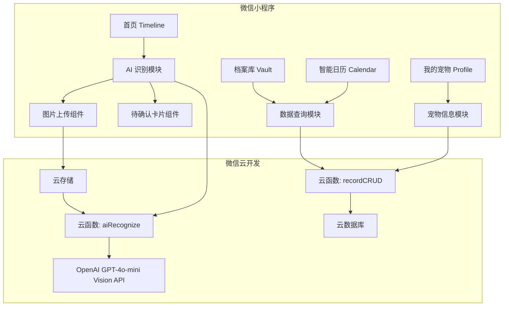

## 用户需求

开发"宠秘（Pet Secretary）"微信小程序，核心解决宠物主人手动记录信息的痛点。用户通过发送聊天截图、病历照片或手写日历照片，AI 自动识别并分类记录宠物的饮食、医疗、美容和日程。

## 产品概述

一款以 AI 图片识别为核心能力的宠物生活管理微信小程序。用户只需拍照或上传图片，AI 自动提取结构化数据（时间、事件类型、备注等），经用户确认后归档到对应分类，形成完整的宠物生活时间线。

## 核心功能

### 四个核心页面

1. **首页 (Timeline/Feed)**

- 以时间轴/瀑布流形式展示已确认的宠物记录卡片（如：复查预约、驱虫记录等）
- 顶部设置醒目的"AI 识别"悬浮按钮（FAB），作为核心操作入口
- 卡片按时间倒序排列，区分不同事件类型并使用不同图标/颜色标识

2. **档案库 (Vault/Dashboard)**

- 聚合展示页，顶部设置"医疗健康、饮食、开销、成长"四个金刚区分类入口
- 每个分类下展示对应类别的记录摘要和统计数据

3. **智能日历 (Calendar)**

- 日历视图展示从图片中提取的所有日程和预约
- 支持按日/月切换查看，日期标记有事件的日期

4. **我的宠物 (Profile)**

- 宠物基本信息设置（名字、品种、生日、头像等）
- 简洁的个人设置页面

### 核心交互 - AI 图片识别流程

- 点击 FAB 按钮后进入"上传/拍照"选择
- 上传图片后展示"AI 正在识别"的 Loading 动画
- 识别完成后展示"待确认卡片"，呈现 AI 提取的结构化数据（时间、事件类型、备注）
- 用户可一键确认或微调数据后保存

### UI 风格

- 温暖、亲和、治愈感的色调（奶油黄、薄荷绿为主色）
- 圆润易读的字体风格
- 极简主义布局，充足留白，无复杂表单

## 技术栈

- **前端框架**: Uni-app (Vue 3 Composition API) + TypeScript
- **原子化样式**: 由于微信小程序环境不支持 Tailwind CSS，采用自定义 SCSS 工具类 + 内联样式实现原子化样式方案
- **后端服务**: 微信云开发 (CloudBase)，包括云函数、云数据库、云存储
- **AI 能力**: 云函数中集成 OpenAI GPT-4o-mini Vision API 进行多模态图片识别
- **构建工具**: Vite (Uni-app 默认)

## 实现方案

### 整体策略

采用 Uni-app (Vue 3) 构建微信小程序，前端负责页面展示和交互，核心 AI 识别逻辑放在云函数中执行。用户上传图片至云存储，触发云函数调用 GPT-4o-mini Vision API 进行识别，返回结构化 JSON 数据，前端渲染为"待确认卡片"供用户确认后写入云数据库。

### 关键技术决策

1. **Uni-app 选型**: 天然支持微信小程序编译，Vue 3 Composition API 提供良好的代码组织能力，生态成熟
2. **云开发 vs 独立后端**: 云开发免运维、免鉴权，与微信生态深度集成，适合 MVP 阶段快速验证；数据库、存储、函数一体化降低架构复杂度
3. **样式方案**: 小程序环境限制较多，采用自定义 SCSS 变量 + 工具类的方式，在 `styles/` 目录下统一管理设计系统（颜色、间距、圆角、字体等），确保一致性
4. **AI 调用放在云函数**: 避免在前端暴露 API Key，云函数中做请求转发和数据清洗，返回标准化结构

### 性能与可靠性

- 图片上传前进行客户端压缩（`uni.compressImage`），减少传输体积
- AI 识别采用异步轮询模式，避免长时间阻塞
- 首页时间轴采用分页加载，每次加载 20 条，避免一次性渲染大量数据
- 云数据库查询建立合理索引（petId + createdAt 联合索引）

## 实现细节

### 注意事项

- `pages.json` 配置 tabBar 四个页面，使用自定义图标
- 全局状态使用 Vue 3 `reactive` + `provide/inject` 轻量方案，避免引入 Pinia 增加包体积
- 云函数调用 OpenAI API 时设置合理的 timeout（30s）和 retry 策略
- 图片识别结果需要做 JSON Schema 校验，防止 AI 返回异常格式
- 所有用户输入（宠物名、备注等）做 XSS 过滤和长度限制

## 架构设计

### 系统架构



### 数据模型

- **pets 集合**: petId, name, breed, birthday, avatar, ownerId, createdAt
- **records 集合**: recordId, petId, type(medical/diet/expense/growth), title, content, eventDate, source(图片URL), aiRawData, status(confirmed/pending), createdAt
- **schedules 集合**: scheduleId, petId, recordId, title, date, time, reminder, status

### 数据流

用户拍照/上传 → 客户端压缩 → 云存储上传 → 云函数接收fileID → 调用 GPT-4o-mini Vision → 返回结构化JSON → 前端渲染待确认卡片 → 用户确认/微调 → 写入云数据库 records 集合 → 首页时间轴刷新

## 目录结构

```
宠物记录/
├── package.json                      # [NEW] 项目依赖配置，包含 uni-app、vue3、typescript 等依赖
├── index.html                        # [NEW] Uni-app Vite 模式入口 HTML
├── vite.config.ts                    # [NEW] Vite 构建配置，集成 uni-app 插件
├── tsconfig.json                     # [NEW] TypeScript 配置
├── manifest.json                     # [NEW] Uni-app 应用配置，包含微信小程序 appid、云开发环境ID等
├── pages.json                        # [NEW] 页面路由和 tabBar 配置，定义四个核心页面路径及自定义 tabBar 图标
├── App.vue                           # [NEW] 应用根组件，初始化云开发环境，提供全局状态
├── main.ts                           # [NEW] 应用入口，创建 Vue 实例并挂载
├── uni.scss                          # [NEW] Uni-app 全局 SCSS 变量文件
├── pages/
│   ├── index/
│   │   └── index.vue                 # [NEW] 首页 Timeline。实现时间轴/瀑布流布局展示记录卡片，包含 FAB 悬浮按钮触发 AI 识别流程，分页加载数据，空状态引导
│   ├── vault/
│   │   └── index.vue                 # [NEW] 档案库 Dashboard。顶部四宫格金刚区（医疗、饮食、开销、成长），下方展示各分类记录摘要和统计卡片
│   ├── calendar/
│   │   └── index.vue                 # [NEW] 智能日历页。日历组件展示事件标记，点击日期展示当日事件列表，支持月份切换
│   └── profile/
│       └── index.vue                 # [NEW] 我的宠物页。宠物头像、基本信息表单（名字、品种、生日），简洁设置项
├── components/
│   ├── RecordCard.vue                # [NEW] 记录卡片组件。展示单条记录（图标、标题、时间、类型标签），支持不同类型样式区分
│   ├── FabButton.vue                 # [NEW] 悬浮操作按钮组件。圆形渐变按钮，点击弹出拍照/相册选择面板
│   ├── AiRecognizeSheet.vue          # [NEW] AI 识别底部弹窗组件。包含图片上传、识别 Loading 动画、识别结果待确认卡片展示，支持一键确认或字段微调编辑
│   ├── ConfirmCard.vue               # [NEW] 待确认卡片组件。展示 AI 提取的结构化数据（时间、事件类型、备注），提供确认和编辑按钮
│   ├── CalendarGrid.vue              # [NEW] 日历网格组件。自定义月历视图，支持日期标记、月份切换动画
│   └── EmptyState.vue                # [NEW] 空状态占位组件。展示引导插图和文案，引导用户开始使用
├── composables/
│   ├── useRecords.ts                 # [NEW] 记录数据 composable。封装 records 集合的 CRUD 操作、分页查询、按类型筛选逻辑
│   ├── usePet.ts                     # [NEW] 宠物信息 composable。封装宠物信息的读写、头像上传
│   └── useAiRecognize.ts             # [NEW] AI 识别 composable。封装图片压缩、上传云存储、调用云函数、轮询结果、状态管理
├── styles/
│   ├── variables.scss                # [NEW] 设计系统变量。定义颜色（奶油黄、薄荷绿等）、间距、圆角、阴影等 SCSS 变量
│   └── utilities.scss                # [NEW] 原子化工具类。提供常用的 flex、padding、margin、text、bg 等工具 class
├── static/
│   ├── icons/
│   │   ├── tab-home.png              # [NEW] TabBar 首页图标
│   │   ├── tab-home-active.png       # [NEW] TabBar 首页选中图标
│   │   ├── tab-vault.png             # [NEW] TabBar 档案库图标
│   │   ├── tab-vault-active.png      # [NEW] TabBar 档案库选中图标
│   │   ├── tab-calendar.png          # [NEW] TabBar 日历图标
│   │   ├── tab-calendar-active.png   # [NEW] TabBar 日历选中图标
│   │   ├── tab-profile.png           # [NEW] TabBar 我的图标
│   │   └── tab-profile-active.png    # [NEW] TabBar 我的选中图标
│   └── images/
│       └── empty-state.png           # [NEW] 空状态引导插图
├── cloudfunctions/
│   └── aiRecognize/
│       ├── index.js                  # [NEW] AI 识别云函数入口。接收图片 fileID，从云存储下载图片，调用 GPT-4o-mini Vision API，解析返回 JSON，做 Schema 校验后返回结构化数据
│       ├── package.json              # [NEW] 云函数依赖，包含 openai SDK
│       └── config.json               # [NEW] 云函数配置，设置超时时间等
└── types/
    └── index.ts                      # [NEW] 全局类型定义。定义 Pet、Record、Schedule、RecognizeResult 等 TypeScript 接口
```

## 关键代码结构

### 核心类型定义 (types/index.ts)

```typescript
// 记录类型枚举
export type RecordType = 'medical' | 'diet' | 'expense' | 'growth'

// 记录状态
export type RecordStatus = 'pending' | 'confirmed'

// 宠物信息
export interface Pet {
  _id?: string
  name: string
  breed: string
  birthday: string
  avatar: string
  ownerId: string
  createdAt: number
}

// 记录条目
export interface PetRecord {
  _id?: string
  petId: string
  type: RecordType
  title: string
  content: string
  eventDate: string
  source?: string       // 原始图片云存储 fileID
  aiRawData?: object    // AI 原始返回数据
  status: RecordStatus
  createdAt: number
}

// AI 识别结果
export interface RecognizeResult {
  type: RecordType
  title: string
  content: string
  eventDate: string
  confidence: number
  schedules?: Array<{
    title: string
    date: string
    time?: string
  }>
}
```

## 设计风格

采用温暖治愈的宠物友好风格，以奶油黄和薄荷绿为核心色调，营造轻松亲和的氛围。整体遵循极简主义设计原则，大量使用留白和圆角元素，弱化边框，使用柔和阴影创造层次感。所有交互保持直觉化，核心操作路径控制在 2 步以内。

## 页面设计

### 页面 1：首页 (Timeline/Feed)

**区块 1 - 顶部状态栏**
左侧显示宠物头像（小圆形）和宠物名称，右侧显示当日日期。背景为奶油黄渐变，底部有柔和的曲线分割线。

**区块 2 - 时间轴内容区**
以时间轴形式纵向排列记录卡片，左侧为时间线（细线+圆点），右侧为卡片内容。每张卡片圆角16px，白色背景，柔和阴影，左侧带颜色条标识类型（医疗-薄荷绿、饮食-橙色、开销-蓝色、成长-粉色）。卡片内含图标、标题、时间、简要内容。

**区块 3 - 空状态引导**
当无记录时显示治愈风插图（可爱宠物剪影），配合文案"拍张照片，让 AI 帮你记录"，引导用户使用核心功能。

**区块 4 - FAB 悬浮按钮**
固定在右下角，距底部 tabBar 上方 20px。圆形按钮直径 56px，薄荷绿到浅蓝渐变背景，中心白色相机图标。点击后弹出底部操作面板。带有轻微的呼吸动画效果吸引注意。

**区块 5 - 底部 TabBar**
四个 tab 图标均匀排列：首页、档案库、日历、我的。选中态为薄荷绿色，未选中为灰色。图标风格为线性圆润风格。

### 页面 2：档案库 (Vault/Dashboard)

**区块 1 - 页面标题栏**
居中标题"档案库"，简洁白色背景。

**区块 2 - 四宫格金刚区**
2x2 网格布局，每个格子为圆角卡片，分别为：医疗健康（薄荷绿背景+听诊器图标）、饮食记录（暖橙背景+碗图标）、开销统计（浅蓝背景+钱币图标）、成长档案（浅粉背景+心形图标）。每个卡片显示分类名和记录数量。

**区块 3 - 最近记录列表**
标题"最近记录"，下方展示最近 5 条记录的简要列表，每项包含类型图标、标题、时间，点击可查看详情。

**区块 4 - 底部 TabBar**
与首页保持一致。

### 页面 3：智能日历 (Calendar)

**区块 1 - 月份切换栏**
居中显示当前年月，左右箭头切换月份，切换时有平滑过渡动画。

**区块 2 - 星期标题行**
一行展示周一至周日，灰色小字。

**区块 3 - 日历网格**
7 列日期网格，当日高亮显示（薄荷绿圆形背景），有事件的日期下方显示小圆点标记（颜色对应事件类型）。点击日期展开当日事件。

**区块 4 - 当日事件列表**
日历下方展示选中日期的事件列表，每条事件为小卡片，包含时间、标题、类型标签。无事件时显示"这天还没有安排"提示文案。

**区块 5 - 底部 TabBar**
与其他页面保持一致。

### 页面 4：我的宠物 (Profile)

**区块 1 - 宠物头像区**
页面顶部居中大圆形头像（80px），下方宠物名称，可点击更换头像。背景为淡奶油黄渐变。

**区块 2 - 基本信息表单**
白色圆角卡片，内含表单项：宠物名字、品种、生日（日期选择器）。每项为单行显示，左侧标签右侧内容，点击可编辑。样式简洁无边框，使用下划线分隔。

**区块 3 - 设置项列表**
包含：数据导出、清除缓存、关于我们等设置项。列表形式，右侧箭头指示。

**区块 4 - 底部 TabBar**
与其他页面保持一致。

### 页面 5：AI 识别弹窗（覆盖层组件）

**区块 1 - 遮罩层**
半透明黑色遮罩覆盖全屏，点击可关闭。

**区块 2 - 底部弹窗面板**
从底部滑入，白色圆角（顶部16px圆角），包含拍照和从相册选择两个入口按钮，图标配文字，横向排列。

**区块 3 - AI 识别 Loading 状态**
上传图片后面板内容切换为 Loading 动画，中心为可爱的宠物爪印旋转动画，下方文案"AI 正在帮你识别..."，营造智能感。

**区块 4 - 待确认卡片**
识别完成后展示结构化数据卡片：事件类型标签（带颜色）、标题（可编辑输入框）、时间（可点击修改）、备注内容（可编辑文本域）。底部两个按钮：灰色"放弃"和薄荷绿"确认保存"。